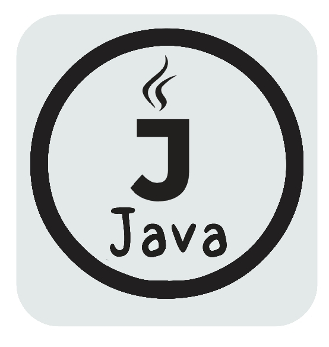
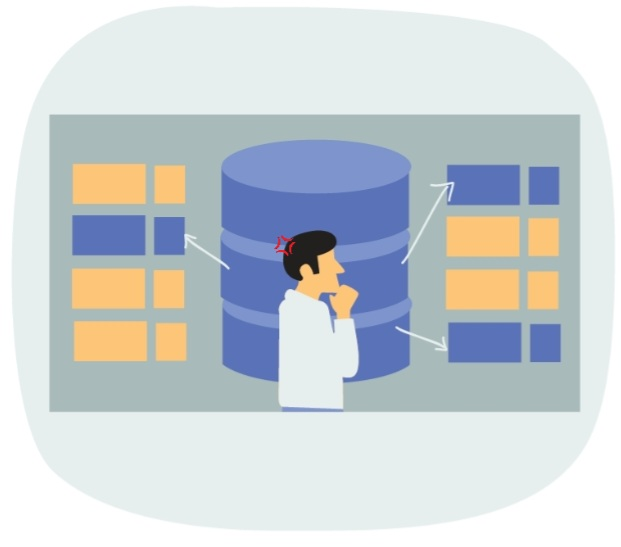
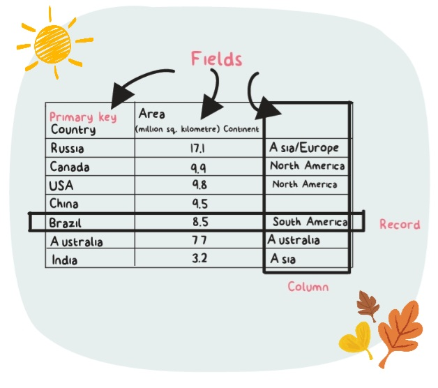
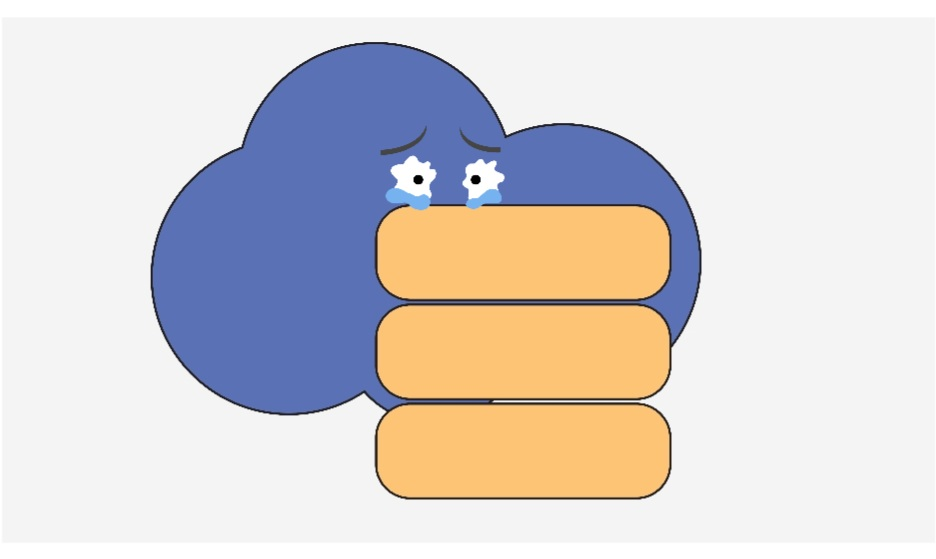
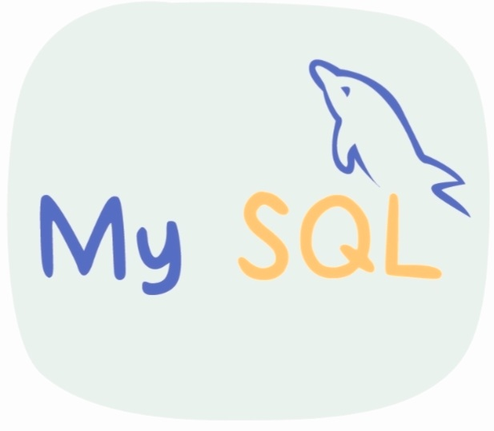

# JDBC-database

In this section, we will learn more about databases, their types, and how to connect a database to our Java program. We will also dive deep into how to interact and manipulate a database using Java.

Databases play a major role in the development of an application. As we know, databases help us to store, access and manipulate data.

We can categorize databases into various categories based on how they store and process data. One of the most common types of database is the Relational database.

A relational database stores the data in the form of tables. A table is a collection of related data entries where the data is stored in rows and columns. You can visualize it just like a spreadsheet.

Let's talk about something called Database Management System (DBMS).

It is a collection of programs that enable the users to access databases, manipulate data, report and represent data, and also control access to the database.

Hence, a relational database is often referred to as a Relational Database Management System (RDBMS). It is one of the most popular DBMS in the industry. To work with relational database systems, we use something called SQL.

SQL is the standard language for relational database systems.

Structured Query Language, commonly known as SQL, is a standard programming language for relational databases. It helps in storing, manipulating, and retrieving data stored in a relational database.

Using SQL, you can query, update, and reorganize data, as well as create and modify the schema (structure) of a database system, and control access to its data.
As we have seen, SQL is the standard language for relational database systems. But, there are different versions of the SQL language.

Some of the examples are MySQL, MS Access, Oracle, Sybase, Informix, Postgres, SQL Server, and more which depend on SQL and use it as the base. MySQL is one such version of SQL that we will be using throughout this section to work with Java.

Navigate to the next screen to look at the overview of MySQL.

MySQL is a freely available open-source Relational Database Management System (RDBMS) that uses Structured Query Language (SQL). It is one of the best RDBMS being used for developing various web-based software applications.

MySQL is compatible with all the major operating systems and works pretty well with major programming languages such as Java, Python, PHP, C++, and more.
Once the installation completes, click the Finish button to close the installation wizard. That's it, MySQL will be successfully installed on your local machine.

To check whether the installation is done successfully, search MySQL Command Line Client on the Windows search bar and open it.
